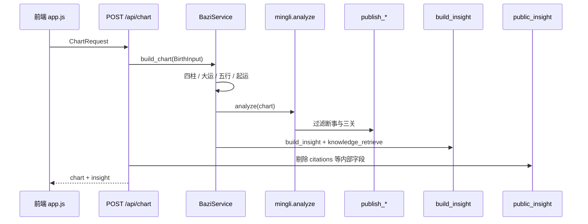

# 问元 · 系统架构（v1.11）

> 本文描述**当前代码实现**的分层、数据流与模块边界。  
> UI 视觉见 [DESIGN.md](DESIGN.md)；产品概览见 [README.md](../README.md)。

---

## 1. 概述

| 项 | 说明 |
|----|------|
| **产品** | 无账号八字 Web：排盘 → 规则层展示 → 可选 AI 解读/追问 |
| **原则** | 程序算、AI 说；先观全盘再高置信断人事；不训模型替代规则 |
| **版本** | `app.__version__`（当前 1.11.x） |
| **状态** | 服务端无状态；生辰默认不落库 |

**技术栈：** FastAPI · Pydantic · lunar-python · DeepSeek API · Jinja2 · 原生 JS · Nginx · systemd

---

## 2. 逻辑分层

```
┌─────────────────────────────────────────────────────────┐
│  表现层   templates/  static/js/app.js  theme.css       │
│           /  /chart  /privacy  ·  sessionStorage        │
├─────────────────────────────────────────────────────────┤
│  接入层   app/main.py  ·  /api/*  ·  /static  ·  /health │
├─────────────────────────────────────────────────────────┤
│  应用层   app/api/routes.py  ·  app/services/ai.py      │
├─────────────────────────────────────────────────────────┤
│  领域层   app/core/*  （排盘、规则、发布过滤、检索）     │
├─────────────────────────────────────────────────────────┤
│  知识层   knowledge/  （JSON 语料 + bazi-wiki + BM25）    │
│           仅服务端 AI 使用，不返回前端                     │
├─────────────────────────────────────────────────────────┤
│  外部     lunar-python  ·  DeepSeek Chat Completions    │
└─────────────────────────────────────────────────────────┘
```

---

## 3. 请求与数据流

### 3.1 排盘（主路径）



**`BirthInput`**（`app/core/bazi.py`）：`date_type` · 年月日时分 · `gender` · `is_leap_month`

**`chart` 顶层字段：**

| 字段 | 说明 |
|------|------|
| `meta` | 命主信息、节令、阳历/农历文案 |
| `pillars` | 四柱明细 |
| `dayun` / `xiaoyun` | 大运、流年、小运 |
| `wuxing_stats` | 五行统计 |
| `pillars_relations` | 刑冲合害等标签 |
| `qiyun` | 起运说明 |
| `insight` | 规则层（见 §4） |

### 3.2 AI 解读 / 追问


- **开关：** `AI_ENABLED`、`DEEPSEEK_API_KEY`（`app/config.py`）
- **L1：** 六章 Markdown 流式（无「历史校准」章）
- **L2/L3：** `POST /api/ask`，可带 `history`；L2 问题来自 `insight.l2_questions`

### 3.3 分享与缓存

| 机制 | 说明 |
|------|------|
| URL `?s=` | Base64URL 编码的排盘输入（`SHARE_VERSION=1`），打开后重新 `POST /chart` |
| `sessionStorage` | 当前 chart、input、AI 解读缓存 |
| `localStorage` | `wenyuan_history` 最近 20 条；`wenyuan_chart_cache` 短期 chart 缓存 |
| 隐私 | 链接含编码生辰；复制前弹窗提示 |

---

## 4. 规则层（`insight`）

### 4.1 编排（`mingli.analyze`）

执行顺序概要：

1. **结构模块：** 滴天髓 · 穷通 · 子平格局 · 神煞（内部）· 断事 raw · 六亲多维验证 raw  
2. **发布过滤（`publish.py`）：**  
   - 断事：仅「强」，或与三关同题且该关「高」置信  
   - 三关：仅「高」置信关  
3. **观命总观（`guanming.py`）：** 天道 / 地道 / 人道 / 盲派做功 / 调候 / 流通等  
4. **要点列表 `highlights`**  
5. **喜用等** 汇总进 `insight` 扁平字段  

### 4.2 对用户可见 vs 仅内部

| 可见（API + UI） | 仅内部（AI / 测试） |
|----------------|---------------------|
| `guanming` | `citations` |
| `highlights`、格局、调候、喜用 | `corpus_meta` |
| `duanshi`（已 publish） | `mingli` 全量副本 |
| `sanguan`（已 publish） | 神煞明细（UI 不展示神煞行） |
| `l2_questions` | `calibration` 模块（UI 已下线） |

**`public_insight()`**（`app/core/insight.py`）在 `/api/chart` 返回前剔除：`citations`、`corpus_meta`、`temperament`、`calibration_items`。

**`ensure_citations()`** 在 AI 请求时若客户端未带 citations，服务端重新 `knowledge_retrieve`。

### 4.3 典籍检索（`knowledge.py`）

- 标签匹配候选 + **BM25** 重排（`knowledge/bm25.py`）  
- 来源：`knowledge/corpus/data/*.json`、`knowledge/bazi-wiki/`、固定 snippets  
- **不向用户展示语料原文**；仅注入 AI 系统提示  

---

## 5. 模块地图（`app/core/`）

| 模块 | 职责 |
|------|------|
| `bazi.py` | 历法转换、四柱、大运、五行、起运；入口 `build_chart` |
| `mingli.py` | 规则层总编排 |
| `guanming.py` | 观命总观（滴天髓框架 + 盲派做功摘要） |
| `ditiansui.py` | 旺衰、体用、气候 |
| `ziping.py` | 格局 |
| `qiongtong.py` | 穷通调候 |
| `yongshen.py` | 喜用倾向 |
| `shensha.py` | 神煞（计算保留，前端不展示） |
| `duanshi.py` | 人事断语（父母/婚姻/财运等） |
| `sanguan.py` | 六亲人事 · 多维验证 |
| `publish.py` | 高置信发布过滤 |
| `relations.py` | 四柱刑冲合害 |
| `insight.py` | `build_insight`、`public_insight`、`l2_questions` |
| `knowledge.py` | 语料检索 |
| `ai_validate.py` | AI 输出应期/话题边界校验 |
| `calibration.py` | 参与式核对项生成（未接入 UI） |

**AI 服务：** `app/services/ai.py` — 提示词、SSE、`OUTPUT_FORMAT` 六章结构

**API：** `app/api/routes.py` — `chart` / `analyze` / `ask`

---

## 6. 前端架构

| 路由 | 初始化 | 职责 |
|------|--------|------|
| `/` | `Wenyuan.initIndexPage()` | 分段表单、出生摘要、提交排盘 |
| `/chart` | `Wenyuan.initChartPage()` | Tab 导航、命盘分区、AI 区、分享/导出 |

单文件主逻辑：`static/js/app.js`（`window.Wenyuan` 导出 API）。

**命盘页信息架构：**

1. **基本** — meta、五行、观命总观、命局要点、断事、六亲印证  
2. **命盘** — 四柱表（无悬浮 tooltip、无神煞行）、卡片视图  
3. **细盘** — 大运流年  
4. **问 AI** — 流式解读、L2 chips、追问输入  

---

## 7. 部署架构

```
浏览器 ──HTTPS──► Nginx (443, Let's Encrypt)
                    │
                    ▼
              Uvicorn :8000 (systemd: wenyuan)
                    │
        ┌───────────┴───────────┐
        ▼                       ▼
  /opt/wenyuan (代码)      DeepSeek API
```

- 部署脚本：`scripts/deploy_remote.py`、`scripts/finish_https.py`  
- 健康检查：`GET /health` → `{ "status": "ok", "version": "…" }`  
- 详见 [DEPLOY.md](../DEPLOY.md)

---

## 8. 测试

- **框架：** pytest（`tests/`）  
- **黄金命例：** `tests/fixtures/golden_charts.json`  
- **前端冒烟：** `scripts/verify_birth_form.mjs`（`tests/test_birth_form_js.py`）  
- 修改 `app/core` 或发布过滤逻辑后应跑全量：`python -m pytest tests/`

---

## 9. 设计原则（代码级）

1. **高置信才展示人事** — `publish.py` + AI 提示词 + `ai_validate.py`  
2. **先观全盘再断事** — `guanming` 在 UI 与 AI 章节顺序上优先  
3. **典籍仅服务 AI** — `public_insight` / `ensure_citations` 分工  
4. **隐私** — 无账号、无落库；分享链接编码生辰  
5. **可关停 AI** — `AI_ENABLED` 503  

---

## 10. 文档索引

| 文档 | 用途 |
|------|------|
| [README.md](../README.md) | 仓库入口、产品概览、快速开始 |
| [DESIGN.md](DESIGN.md) | UI/UX 规范 |
| [DEPLOY.md](../DEPLOY.md) | 运维部署 |
| [knowledge/ATTRIBUTION.md](../knowledge/ATTRIBUTION.md) | 语料版权与来源 |
