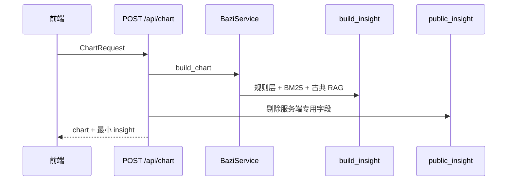

# 问元 · 系统架构

> 描述当前代码实现的分层、数据流与模块边界。  
> 应用版本见 `app.__version__`；UI 见 [DESIGN.md](DESIGN.md)；读盘模型见 [READING.md](READING.md)。

---

## 1. 概述

| 项 | 说明 |
|----|------|
| **产品** | 无账号八字 Web：排盘 → 命盘展示 → 服务端规则层 → AI 解读/追问 |
| **原则** | 程序算、AI 说；规则层在服务端全量计算，浏览器不暴露明细 |
| **版本** | `app.__version__`（`/health` 返回） |
| **状态** | 服务端无状态；生辰默认不落库 |

**技术栈：** FastAPI · Pydantic · lunar-python · DeepSeek API · Jinja2 · 原生 JS · Nginx · systemd

---

## 2. 逻辑分层

```
┌─────────────────────────────────────────────────────────┐
│  表现层   templates/  static/js/app.js  theme.css       │
│           /  /chart  /privacy  /support  · sessionStorage│
├─────────────────────────────────────────────────────────┤
│  接入层   app/main.py  ·  /api/*  ·  /static  ·  /health │
├─────────────────────────────────────────────────────────┤
│  应用层   app/api/routes.py  ·  app/services/ai.py      │
├─────────────────────────────────────────────────────────┤
│  领域层   app/core/*  （排盘、规则、读盘编排、校验、RAG） │
├─────────────────────────────────────────────────────────┤
│  知识层   knowledge/  （JSON 语料 + bazi-wiki + BM25）    │
│           仅服务端 AI 使用，不返回前端                     │
├─────────────────────────────────────────────────────────┤
│  外部     lunar-python  ·  DeepSeek Chat Completions    │
└─────────────────────────────────────────────────────────┘
```

---

## 3. 请求与数据流

### 3.1 排盘



**`public_insight()` 返回字段（仅客户端可见）：**

- `current_dayun` / `current_year_liunian`
- `l2_questions` — 按人生阶段生成的通用追问 chips

**不在 API 中返回：** 观命、断事、三关、highlights、citations、classical_refs 等（v1.14 起规则层 UI 下线，由 AI 承载解读）。

### 3.2 AI 解读 / 追问


- **开关：** `AI_ENABLED`、`DEEPSEEK_API_KEY`（`app/config.py`）
- **L1：** `POST /api/analyze` — Markdown 流式；流结束后校验，必要时二次修订，`done` 事件返回最终稿
- **L2/L3：** `POST /api/ask` — 同上校验/修订；可带 `history`（最多 100 轮）
- **传输：** 默认 `Accept: text/event-stream`；亦可 JSON 非流式（不带 SSE 头）
- **客户端 `insight` 字段：** 请求体中的 `insight` 被服务端忽略，始终 `build_insight(chart)` 重建

### 3.3 分享与缓存

| 机制 | 说明 |
|------|------|
| URL `?s=` | Base64URL 编码排盘输入，打开后重新 `POST /api/chart` |
| `sessionStorage` | 当前 chart、input、AI 解读缓存（`wenyuan_chart` 等） |
| `localStorage` | `wenyuan_history` 最近 20 条排盘摘要 |
| 隐私 | 链接含编码生辰；复制前弹窗提示 |

---

## 4. 规则层（服务端 `insight`）

### 4.1 编排

1. **结构：** 滴天髓 · 穷通 · 子平格局 · 观命总观 · 断事 · 六亲多维验证  
2. **呈现 tier**（`reading.py`）：`assert` 直断 · `hint` 结构提示 · `structure` 宫位 · `hidden` 不展示  
3. **人生阶段**（`lifestage.py` + `apply_stage_presentation`）：年龄调侧重，不删计算  
4. **检索：** BM25 典籍（`knowledge.py`）+ 相似古籍命例 RAG（`classical_ref.py`）  
5. **AI 锚定：** `ai_reading_brief` + `_format_insight` 注入提示词  

### 4.2 校验（`ai_validate.py`）

- 直断应期年份窗口（出生年豁免）
- 无直断时拦截「必破财/必离婚/父母必克」等断言
- 平衡命禁止混用身强/身弱

---

## 5. 模块地图（`app/core/`）

| 模块 | 职责 |
|------|------|
| `bazi.py` | 历法、四柱、大运、五行 |
| `mingli.py` | 规则层总编排 |
| `reading.py` | 三阶读盘、呈现 tier、AI 输出格式、`public_l2_questions` |
| `guanming.py` | 观命总观 |
| `duanshi.py` / `sanguan.py` | 断事 / 六亲多维验证 |
| `classical_ref.py` | 古籍命例 RAG |
| `insight.py` | `build_insight`、`public_insight`、`ensure_ai_insight` |
| `knowledge.py` | BM25 语料检索 |
| `ai_validate.py` | AI 输出边界校验 |
| `lifestage.py` | 人生阶段权重 |
| `liunian_detail.py` | 流年/流月应期 |
| `publish.py` | 发布过滤（委托 `reading.py`） |
| `calibration.py` | 参与式核对（未接入 UI） |

**AI 服务：** `app/services/ai.py` — 提示词、SSE、流式后修订

**API：** `app/api/routes.py` — `chart` / `analyze` / `ask`

---

## 6. 前端架构

| 路由 | 职责 |
|------|------|
| `/` | 排盘表单、最近排盘 |
| `/chart` | Tab：基本 · 命盘 · 细盘 · **问 AI** |
| `/privacy` | 隐私说明 |
| `/support` | 自愿赞赏 |

命盘页 **不展示** 程序化观命/断事面板（v1.14+）；规则层结论通过 AI 解读呈现。

---

## 7. 部署

```
浏览器 ──HTTPS──► Nginx
                    ▼
              Uvicorn :8000 (systemd: wenyuan)
                    ▼
              DeepSeek API
```

- 部署：`scripts/deploy_remote.py HOST PASSWORD`（SFTP，不上传 `scripts/`、`.env`）
- HTTPS 续配：`scripts/finish_https.py HOST PASSWORD`（需 CLI 传参，**勿提交密码**）
- 健康检查：`GET /health` → `{ "status": "ok", "version": "…" }`
- 详见 [DEPLOY.md](../DEPLOY.md)

---

## 8. 测试与质量

| 类型 | 命令 |
|------|------|
| 单元测试 | `python -m pytest tests/ -q` |
| 规则回归 | `python scripts/regression_rules.py`（831 古典案例） |
| AI 回归 | `python scripts/regression_ai.py`（50 古典 gz 案例） |
| 飞轮 | `python scripts/run_flywheel.py` |
| 前端冒烟 | `npm run test:birth-form` |

---

## 9. 设计原则

1. **规则层服务端完整、客户端最小** — `public_insight` vs `ensure_ai_insight`  
2. **分级呈现** — 直断 / 结构提示 / 宫位，AI 与程序同源  
3. **典籍与 RAG 仅服务 AI** — 不向浏览器返回语料原文  
4. **流式 + 静默修订** — 用户看到 `done` 中的最终校验稿  
5. **隐私** — 无账号、无落库  

---

## 10. 文档索引

| 文档 | 用途 |
|------|------|
| [README.md](../README.md) | 仓库入口 |
| [DESIGN.md](DESIGN.md) | UI/UX |
| [READING.md](READING.md) | 三阶读盘模型 |
| [DEPLOY.md](../DEPLOY.md) | 运维 |
| [knowledge/ATTRIBUTION.md](../knowledge/ATTRIBUTION.md) | 语料版权 |
